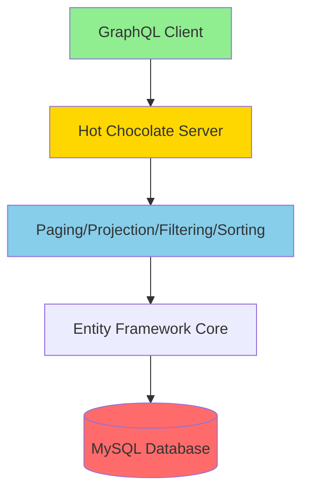

# StuffTracker Documentation Index

This document provides a quick reference to all documentation in the StuffTracker project.

## Quick Start Guides

| Document | Purpose | Audience |
|----------|---------|----------|
| [README.md](README.md) | Main project documentation with setup, architecture, and usage | All users |
| [README_Nitro.md](README_Nitro.md) | Complete guide to Banana Cake Pop GraphQL IDE | Developers, API testers |
| [README_Docker.md](README_Docker.md) | Docker Compose and MySQL setup | DevOps, developers |

## Architecture & Design

| Document | Purpose | Key Topics |
|----------|---------|-----------|
| [docs/basic-idea.md](docs/basic-idea.md) | Original project concept and design rationale | Project goals, domain model, tech stack |
| [docs/HotChocolate-Limitations.md](docs/HotChocolate-Limitations.md) | Hot Chocolate implementation patterns | EF/GraphQL separation, ObjectType pattern, resolver patterns |
| [README.md - Architecture](README.md#architecture) | System architecture with Mermaid diagrams | System flow, data model, middleware pipeline |

## Implementation Details

| Document | Purpose | Key Topics |
|----------|---------|-----------|
| [KEYSET_PAGINATION_IMPLEMENTATION.md](KEYSET_PAGINATION_IMPLEMENTATION.md) | Keyset pagination setup and verification | Configuration, SQL generation, testing |
| [docs/Custom-Sort-Types.md](docs/Custom-Sort-Types.md) | Custom sort type implementation | Deterministic pagination, Id tiebreakers |

## Key Concepts

### System Architecture



### Data Model

- **Locations** (3 seeded):
  - Home
  - Rental 101 Howards Ave
  - Flip 3231 Gooseneck Rd
- **Rooms** (12 seeded, 4 per location):
  - Home: Garage, Basement, Attic, Office
  - Rental: Living Room, Kitchen, Bedroom, Bathroom
  - Flip: Workshop, Storage, Main Floor, Garage
- **Items** (~200 seeded with diverse patterns):
  - Electronics (TV, Radio, Speaker, lamp, etc.)
  - Furniture (chair, table, desk, etc.)
  - Kitchen items (Microwave, Oven, etc.)
  - Tools (Hammer, Screwdriver, wrench, etc.)
  - Office Supplies (Pen, Notebook, Stapler, etc.)

### Technology Stack

- **.NET 9** - Application framework
- **Hot Chocolate v15** - GraphQL server
- **Entity Framework Core** - ORM
- **MySQL 8.0** - Database
- **Docker Compose** - Container orchestration

## Feature Reference

### Pagination

- **Type:** Keyset (cursor-based) pagination
- **Benefits:** Consistent O(log n) performance, stable cursors
- **SQL:** Uses `WHERE (field, id) > (val1, val2)` instead of `OFFSET`
- **Details:** [KEYSET_PAGINATION_IMPLEMENTATION.md](KEYSET_PAGINATION_IMPLEMENTATION.md)

### Filtering

- **Operators:** `eq`, `neq`, `gt`, `gte`, `lt`, `lte`, `in`, `nin`, `contains`, `startsWith`, `endsWith`
- **Translation:** Client filters → SQL WHERE clauses
- **Example:** `where: { name: { contains: "lamp" } }` → `WHERE Name LIKE '%lamp%'`

### Sorting

- **Custom Sort Types:** Explicit `Id` field for deterministic ordering
- **Client Control:** `order: { name: ASC, id: ASC }` → `ORDER BY Name, Id`
- **Details:** [docs/Custom-Sort-Types.md](docs/Custom-Sort-Types.md)

### EF/GraphQL Separation

- **Pattern:** `ObjectType<TEntity>` maps EF entities to GraphQL types
- **Projection:** Automatic via `[UseProjection]` attribute
- **Benefits:** Clean separation, type safety, efficient queries
- **Details:** [docs/HotChocolate-Limitations.md](docs/HotChocolate-Limitations.md)

## API Examples

### Query with Pagination, Filtering, Sorting

```graphql
query {
  items(
    first: 10
    where: { quantity: { gt: 5 } }
    order: { name: ASC, id: ASC }
  ) {
    nodes {
      id
      name
      quantity
    }
    pageInfo {
      hasNextPage
      endCursor
    }
  }
}
```

### Mutation Example

```graphql
mutation {
  addLocation(name: "Storage Unit 5B") {
    id
    name
    createdAt
  }
}
```

### Next Page Navigation

```graphql
query {
  items(
    first: 10
    after: "cursor_from_previous_page"
    order: { name: ASC, id: ASC }
  ) {
    nodes { id name }
    pageInfo { hasNextPage }
  }
}
```

## External Resources

- [Hot Chocolate Documentation](https://chillicream.com/docs/hotchocolate)
- [GraphQL Cursor Connections Specification](https://relay.dev/graphql/connections.htm)
- [Entity Framework Core Documentation](https://learn.microsoft.com/en-us/ef/core/)
- [.NET 9 Documentation](https://learn.microsoft.com/en-us/dotnet/core/whats-new/dotnet-9)

## Document History

- **Created:** November 3, 2025
- **Documentation Consolidation:** November 3, 2025
- **Status:** Current and complete

---

For questions or contributions, see [README.md](README.md).

