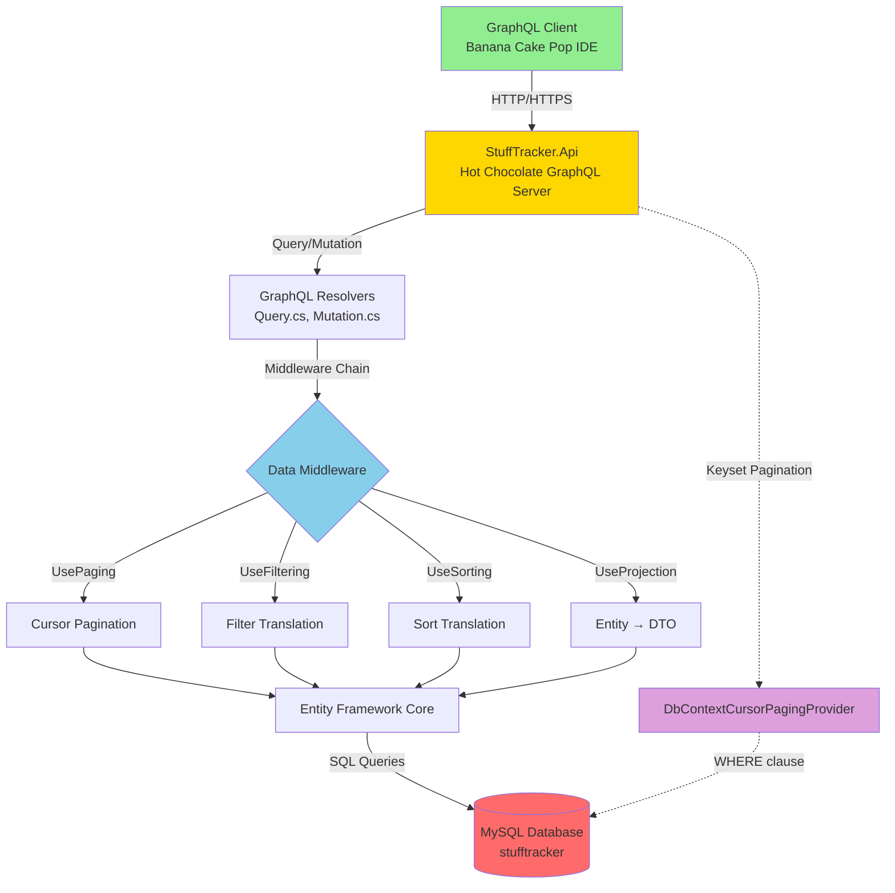
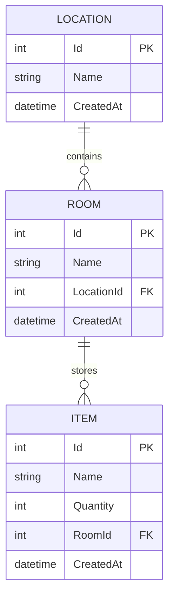

# StuffTracker

A simple inventory management application built with .NET 9 and Hot Chocolate GraphQL to track possessions across different locations and rooms.

## Overview

StuffTracker is a GraphQL-based inventory management system that allows you to:

- Track **Locations** (e.g., *Home in Cary*, *Lake House*)
- Track **Rooms** within those locations (e.g., *Garage*, *Living Room*, *Boat Shed*)
- Track **Items** within rooms (e.g., *Drill*, *TV*, *Kayak Paddle*)

The application demonstrates GraphQL best practices including:
- Cursor-based pagination
- Filtering and sorting
- Entity Framework Core integration with strict EF/GQL separation
- Comprehensive test coverage

## Prerequisites

- **.NET 9 SDK** (or later)
- **Docker** and **Docker Compose** (for MySQL database)
- **dotnet-ef** tool (for migrations)

### Installing .NET 9 SDK

Download and install from [Microsoft's .NET download page](https://dotnet.microsoft.com/download/dotnet/9.0).

### Installing dotnet-ef Tool

```bash
dotnet tool install --global dotnet-ef
```

If already installed, ensure it matches your .NET version:

```bash
dotnet tool update --global dotnet-ef
```

### Verifying Prerequisites

```bash
dotnet --version    # Should show 9.x.x or later
docker --version    # Docker should be installed
docker-compose --version  # Docker Compose should be available
dotnet ef --version  # EF Core tools should be available
```

## Getting Started

### 1. Clone the Repository

```bash
git clone <repository-url>
cd stuff-tracker
```

### 2. Restore Dependencies

```bash
dotnet restore
```

### 3. Set Up the Database

Start the MySQL database using Docker Compose:

```bash
docker-compose up -d
```

Wait for the database to be ready (health check completes automatically).

### 4. Apply Database Migrations

```bash
cd StuffTracker.Api
dotnet ef database update
cd ..
```

The database schema will be created and initial seed data will be loaded automatically in the development environment.

## Starting Services

### Start the Database

```bash
docker-compose up -d
```

Verify the database is running:

```bash
docker-compose ps
```

### Start the API

The API can be started using the .NET CLI:

```bash
cd StuffTracker.Api
dotnet run
```

The API will start on:
- **HTTP**: `http://localhost:5030`
- **HTTPS**: `https://localhost:7185`
- **GraphQL Endpoint**: `http://localhost:5030/graphql` (or `https://localhost:7185/graphql`)

#### GraphQL IDE (Banana Cake Pop)

In development mode, the GraphQL IDE (Banana Cake Pop) is automatically available at the GraphQL endpoint. Open your browser and navigate to `http://localhost:5030/graphql` to explore the GraphQL schema and test queries.

### Verify Services Are Running

**Database:**
```bash
docker-compose ps
```

**API:**
- Open `http://localhost:5030/graphql` in your browser
- The GraphQL IDE should load

## Stopping Services

### Stop the API

Stop the API by pressing `Ctrl+C` in the terminal where it's running, or simply close the terminal.

### Stop the Database

```bash
docker-compose down
```

To stop and remove all data (reset database):

```bash
docker-compose down -v
```

This removes the Docker volume containing database data. The database will be recreated with seed data on next startup.

## Testing

### Run All Tests

```bash
dotnet test
```

### Run Tests with Verbose Output

```bash
dotnet test --verbosity normal
```

### Run Specific Test Projects

```bash
# Run all tests in the test project
dotnet test StuffTracker.Tests/

# Run a specific test class
dotnet test --filter "FullyQualifiedName~FilteringSortingPaginationTests"

# Run a specific test method
dotnet test --filter "FullyQualifiedName~FilteringSortingPaginationTests.TestName"
```

### Test Coverage

The test suite includes:

- **Integration Tests**: Comprehensive GraphQL endpoint testing
  - Filtering, sorting, and pagination tests
  - Mutation tests (create, move, delete operations)
  - Test database isolation using `stufftracker_test`

### Running Tests with Test Database

The test suite automatically uses a separate test database (`stufftracker_test`) to ensure isolation from development data. The test database is created automatically by the initialization script when the MySQL container starts.

## Architecture

### System Architecture



### Data Model



### GraphQL Middleware Flow

```mermaid
graph LR
    Request[GraphQL Request] -->|Parse| Schema[Schema Validation]
    Schema -->|Resolve| Resolver[Query/Mutation Resolver]
    Resolver -->|IQueryable Entity| Middleware1[UsePaging]
    Middleware1 -->|Apply Cursors| Middleware2[UseProjection]
    Middleware2 -->|Entity → DTO| Middleware3[UseFiltering]
    Middleware3 -->|WHERE| Middleware4[UseSorting]
    Middleware4 -->|ORDER BY| EFCore[EF Core Translation]
    EFCore -->|Optimized SQL| Database[(MySQL)]
    Database -->|Results| DTOs[GraphQL DTOs]
    DTOs -->|JSON| Response[GraphQL Response]
    
    style Request fill:#90EE90
    style Middleware1 fill:#FFD700
    style Middleware2 fill:#87CEEB
    style Middleware3 fill:#DDA0DD
    style Middleware4 fill:#FFA07A
    style Database fill:#FF6B6B
    style Response fill:#90EE90
```



## Project Structure

```
stuff-tracker/
├── StuffTracker.Api/           # GraphQL API project
│   ├── GraphQL/                # GraphQL resolvers and types
│   │   ├── Query.cs            # Query resolvers
│   │   ├── Mutation.cs         # Mutation resolvers
│   │   ├── Types/              # GraphQL ObjectType mappings
│   │   │   ├── LocationType.cs # Location GraphQL type
│   │   │   ├── RoomType.cs     # Room GraphQL type
│   │   │   └── ItemType.cs     # Item GraphQL type
│   │   └── Sorting/            # Custom sort types
│   │       ├── LocationSortType.cs
│   │       └── ItemSortType.cs
│   ├── Data/                   # Data seeding
│   ├── Migrations/             # EF Core migrations
│   └── Program.cs              # Application entry point
├── StuffTracker.Domain/        # Domain layer
│   ├── Entities/               # EF Core entities
│   │   ├── LocationEntity.cs
│   │   ├── RoomEntity.cs
│   │   └── ItemEntity.cs
│   └── Data/                   # DbContext and factory
│       └── StuffTrackerDbContext.cs
├── StuffTracker.Tests/         # Test project
│   └── Integration/            # Integration tests
├── docker-compose.yml          # Docker Compose configuration
├── docs/                       # Documentation
└── README.md                   # This file
```

## Database Configuration

### Development Database

- **Container Name:** `stufftracker-mysql`
- **Port:** `3306`
- **Database:** `stufftracker`
- **Username:** `root`
- **Password:** `Password12`
- **Connection String:** `Server=localhost;Database=stufftracker;User=root;Password=Password12;`

### Test Database

- **Database:** `stufftracker_test` (same MySQL instance)
- **Connection String:** `Server=localhost;Database=stufftracker_test;User=root;Password=Password12;`

The test database is automatically created on first startup via the initialization script.

### Connect to MySQL

```bash
docker exec -it stufftracker-mysql mysql -uroot -pPassword12
```

## GraphQL API

### Example Queries

**Get all locations:**
```graphql
query {
  locations {
    edges {
      node {
        id
        name
        createdAt
      }
    }
    pageInfo {
      hasNextPage
      hasPreviousPage
    }
  }
}
```

**Get items with filtering and pagination:**
```graphql
query {
  items(first: 10, where: { name: { contains: "drill" } }) {
    edges {
      node {
        id
        name
        quantity
      }
      cursor
    }
    pageInfo {
      hasNextPage
      startCursor
      endCursor
    }
  }
}
```

**Add a new location:**
```graphql
mutation {
  addLocation(name: "Lake House") {
    id
    name
    createdAt
  }
}
```

### GraphQL Features

- **Keyset Pagination**: True cursor-based pagination using WHERE clause comparisons (not OFFSET) for optimal performance
- **Filtering**: Automatic filtering support on entity properties via Hot Chocolate middleware
- **Sorting**: Automatic sorting support with client-specified order taking precedence
- **Strict EF/GQL Separation**: GraphQL types backed by EF entities with automatic projection via `ObjectType<T>`

## Documentation

### Getting Started
- **[README_Nitro.md](README_Nitro.md)** - Complete guide to using Banana Cake Pop GraphQL IDE with examples, diagrams, and best practices
- **[README_Docker.md](README_Docker.md)** - Docker Compose setup and MySQL database configuration

### Architecture & Implementation
- **[docs/basic-idea.md](docs/basic-idea.md)** - Original project concept and design rationale
- **[docs/HotChocolate-Limitations.md](docs/HotChocolate-Limitations.md)** - Deep dive into EF/GraphQL separation patterns and Hot Chocolate constraints
- **[docs/Custom-Sort-Types.md](docs/Custom-Sort-Types.md)** - Custom sort type implementation for deterministic keyset pagination
- **[KEYSET_PAGINATION_IMPLEMENTATION.md](KEYSET_PAGINATION_IMPLEMENTATION.md)** - Keyset pagination configuration and verification guide

### External Resources
- [Hot Chocolate Documentation](https://chillicream.com/docs/hotchocolate)
- [GraphQL Cursor Connections Specification](https://relay.dev/graphql/connections.htm)
- [Entity Framework Core Documentation](https://learn.microsoft.com/en-us/ef/core/)

## Troubleshooting

### Database Connection Issues

If the API cannot connect to the database:

1. Verify the database container is running:
   ```bash
   docker-compose ps
   ```

2. Check database logs:
   ```bash
   docker-compose logs mysql
   ```

3. Ensure the database health check has completed (wait ~30 seconds after starting)

### Migration Issues

If migrations fail:

1. Ensure the database is running
2. Check connection string in `appsettings.json`
3. Try resetting the database:
   ```bash
   docker-compose down -v
   docker-compose up -d
   cd StuffTracker.Api
   dotnet ef database update
   ```

### Test Failures

If tests fail:

1. Ensure the database is running (tests need the test database)
2. Verify the test database was created:
   ```bash
   docker exec -it stufftracker-mysql mysql -uroot -pPassword12 -e "SHOW DATABASES;"
   ```
3. Try resetting the database and running tests again

### Port Conflicts

If port 3306 (MySQL) is already in use:

1. Change the port mapping in `docker-compose.yml`
2. Update the connection string in `appsettings.json` and `appsettings.Development.json`

If ports 5030 or 7185 (API) are in use:

1. Change the ports in `StuffTracker.Api/Properties/launchSettings.json`
2. Update any URLs you use to access the API

## License

[Add license information here if applicable]

## Contributing

[Add contribution guidelines here if applicable]

