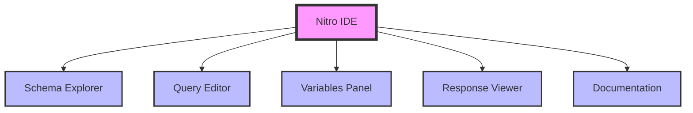
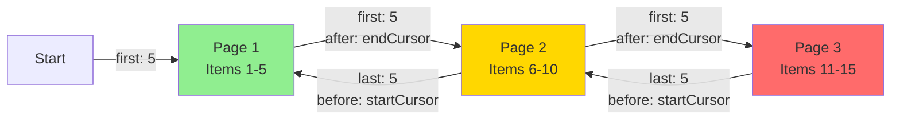
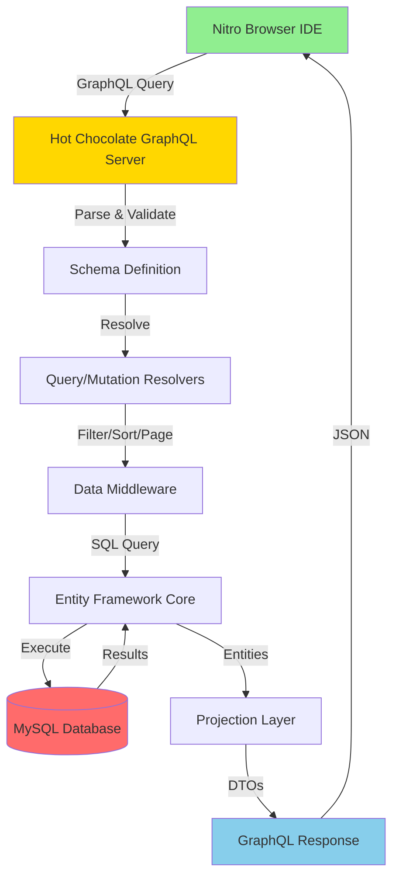
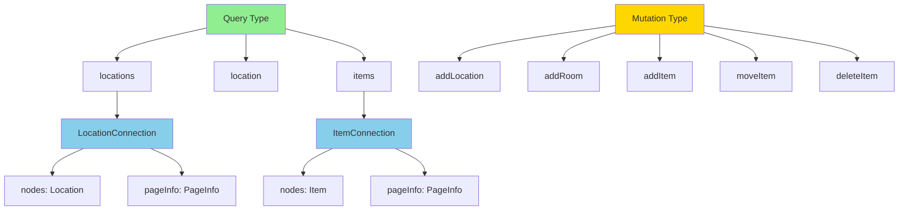
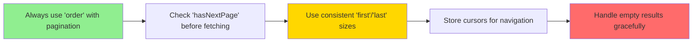

# Using Nitro (Banana Cake Pop) with StuffTracker GraphQL API

This guide demonstrates how to use Nitro (Banana Cake Pop), Hot Chocolate's built-in GraphQL IDE, to interact with the StuffTracker GraphQL API.

## What is Nitro?

**Nitro** (also known as **Banana Cake Pop**) is Hot Chocolate's powerful GraphQL IDE that provides:
- 🎨 Modern, intuitive UI
- 📖 Auto-generated schema documentation
- 🔍 Query autocomplete and validation
- 📊 Real-time query execution
- 🎯 Built-in support for pagination, filtering, and sorting

## Prerequisites

1. **API running** - Start the API using `dotnet run` from the `StuffTracker.Api` directory
2. **Database running** - Ensure MySQL is running via Docker Compose (`docker-compose up -d`)
3. **Web browser** - Chrome, Firefox, Safari, or Edge

## Accessing Nitro

### Development Environment

1. Start the API:
   ```bash
   cd StuffTracker.Api
   dotnet run
   ```

2. Open your browser and navigate to:
   - **HTTP:** `http://localhost:5030/graphql`
   - **HTTPS:** `https://localhost:7185/graphql`

3. Nitro will automatically load with the GraphQL schema explorer

> **Note:** Nitro is only available in **Development** mode for security reasons.

## Getting Started

### Interface Overview



---

## Basic Queries

### 1. Get All Locations

```graphql
query {
  locations(first: 10) {
    nodes {
      id
      name
      createdAt
    }
    pageInfo {
      hasNextPage
      hasPreviousPage
      startCursor
      endCursor
    }
  }
}
```

**Expected Response:**
```json
{
  "data": {
    "locations": {
      "nodes": [
        {
          "id": 1,
          "name": "Home",
          "createdAt": "2024-01-15T10:30:00Z"
        },
        {
          "id": 2,
          "name": "Rental 101 Howards Ave",
          "createdAt": "2024-01-15T11:00:00Z"
        },
        {
          "id": 3,
          "name": "Flip 3231 Gooseneck Rd",
          "createdAt": "2024-01-15T11:30:00Z"
        }
      ],
      "pageInfo": {
        "hasNextPage": false,
        "hasPreviousPage": false,
        "startCursor": "MA==",
        "endCursor": "MQ=="
      }
    }
  }
}
```

### 2. Get a Single Location by ID

```graphql
query {
  location(id: 1) {
    id
    name
    createdAt
  }
}
```

### 3. Search Items by Name

```graphql
query {
  items(search: "lamp", first: 10) {
    nodes {
      id
      name
      quantity
      roomId
      createdAt
    }
  }
}
```

### 4. Get All Items

```graphql
query {
  items(search: null, first: 20) {
    nodes {
      id
      name
      quantity
      roomId
      createdAt
    }
    pageInfo {
      hasNextPage
      endCursor
    }
  }
}
```

---

## Filtering

Hot Chocolate provides powerful filtering capabilities on all fields.

### Filter Items by Name (Contains)

```graphql
query {
  items(
    first: 10
    where: {
      name: { contains: "box" }
    }
  ) {
    nodes {
      id
      name
      quantity
    }
  }
}
```

### Filter Items by Quantity (Greater Than)

```graphql
query {
  items(
    first: 10
    where: {
      quantity: { gt: 5 }
    }
  ) {
    nodes {
      id
      name
      quantity
    }
  }
}
```

### Filter Items by Room ID

```graphql
query {
  items(
    first: 10
    where: {
      roomId: { eq: 3 }
    }
  ) {
    nodes {
      id
      name
      quantity
      roomId
    }
  }
}
```

### Combined Filters (AND logic)

```graphql
query {
  items(
    first: 10
    where: {
      name: { contains: "electronics" }
      quantity: { gte: 2 }
      roomId: { in: [1, 2, 3] }
    }
  ) {
    nodes {
      id
      name
      quantity
      roomId
    }
  }
}
```

### Available Filter Operators

| Operator | Description | Example |
|----------|-------------|---------|
| `eq` | Equal to | `{ quantity: { eq: 5 } }` |
| `neq` | Not equal to | `{ quantity: { neq: 0 } }` |
| `gt` | Greater than | `{ quantity: { gt: 10 } }` |
| `gte` | Greater than or equal | `{ quantity: { gte: 5 } }` |
| `lt` | Less than | `{ quantity: { lt: 100 } }` |
| `lte` | Less than or equal | `{ quantity: { lte: 50 } }` |
| `in` | In array | `{ id: { in: [1, 2, 3] } }` |
| `nin` | Not in array | `{ id: { nin: [4, 5] } }` |
| `contains` | String contains | `{ name: { contains: "box" } }` |
| `startsWith` | String starts with | `{ name: { startsWith: "elec" } }` |
| `endsWith` | String ends with | `{ name: { endsWith: "ion" } }` |

---

## Sorting

> **💡 Pro Tip:** For deterministic pagination, always include `id` in your sort order when sorting by fields that may have duplicate values. This ensures stable cursor pagination.

### Sort by Name (Ascending)

```graphql
query {
  locations(
    first: 10
    order: { name: ASC, id: ASC }
  ) {
    nodes {
      id
      name
    }
  }
}
```

### Sort by Name (Descending)

```graphql
query {
  items(
    first: 10
    order: { name: DESC, id: ASC }
  ) {
    nodes {
      id
      name
      quantity
    }
  }
}
```

### Sort by Multiple Fields

```graphql
query {
  items(
    first: 10
    order: { quantity: DESC, name: ASC, id: ASC }
  ) {
    nodes {
      id
      name
      quantity
    }
  }
}
```

**Note:** Including `id: ASC` as the final sort field ensures deterministic ordering when `quantity` and `name` have duplicate values.

### Sort with Filtering

```graphql
query {
  items(
    first: 10
    where: { name: { contains: "box" } }
    order: { name: ASC, id: ASC }
  ) {
    nodes {
      id
      name
      quantity
    }
  }
}
```

---

## Cursor-Based Pagination

Cursor pagination provides stable, efficient navigation through large datasets.

### Pagination Flow



### Forward Pagination

#### Step 1: Get First Page

```graphql
query {
  locations(
    first: 5
    order: { name: ASC }
  ) {
    nodes {
      id
      name
    }
    pageInfo {
      hasNextPage
      hasPreviousPage
      startCursor
      endCursor      # ← Use this for next page
    }
  }
}
```

#### Step 2: Get Next Page

```graphql
query {
  locations(
    first: 5
    after: "NA=="    # ← endCursor from previous response
    order: { name: ASC }
  ) {
    nodes {
      id
      name
    }
    pageInfo {
      hasNextPage
      endCursor      # ← Use this to continue forward
    }
  }
}
```

### Backward Pagination

#### Step 1: Get Last Page

```graphql
query {
  locations(
    last: 5
    order: { name: ASC }
  ) {
    nodes {
      id
      name
    }
    pageInfo {
      hasNextPage
      hasPreviousPage
      startCursor    # ← Use this for previous page
      endCursor
    }
  }
}
```

#### Step 2: Get Previous Page

```graphql
query {
  locations(
    last: 5
    before: "OA=="   # ← startCursor from previous response
    order: { name: ASC }
  ) {
    nodes {
      id
      name
    }
    pageInfo {
      hasPreviousPage
      startCursor    # ← Use this to continue backward
    }
  }
}
```

### Pagination Parameters

| Parameter | Type | Description | Use Case |
|-----------|------|-------------|----------|
| `first` | Int | Get first N items | Forward pagination |
| `after` | String | Cursor to start after | Next page |
| `last` | Int | Get last N items | Backward pagination |
| `before` | String | Cursor to start before | Previous page |

### PageInfo Fields

| Field | Type | Description |
|-------|------|-------------|
| `hasNextPage` | Boolean | More items exist after current page |
| `hasPreviousPage` | Boolean | More items exist before current page |
| `startCursor` | String | Cursor pointing to first item in page |
| `endCursor` | String | Cursor pointing to last item in page |

### Complete Pagination Example

```graphql
query {
  items(
    first: 10
    after: "MTU="
    where: { name: { contains: "electronics" } }
    order: { name: ASC }
  ) {
    nodes {
      id
      name
      quantity
      roomId
    }
    pageInfo {
      hasNextPage
      hasPreviousPage
      startCursor
      endCursor
    }
    totalCount       # ← Total number of items matching filter
  }
}
```

---

## Mutations

### 1. Create a Location

```graphql
mutation {
  addLocation(name: "Storage Unit 5B") {
    id
    name
    createdAt
  }
}
```

**Expected Response:**
```json
{
  "data": {
    "addLocation": {
      "id": 4,
      "name": "Storage Unit 5B",
      "createdAt": "2024-01-15T10:30:00Z"
    }
  }
}
```

### 2. Create a Room

```graphql
mutation {
  addRoom(name: "Office", locationId: 1) {
    id
    name
    locationId
    createdAt
  }
}
```

### 3. Create an Item

```graphql
mutation {
  addItem(name: "Winter Clothes", quantity: 10, roomId: 2) {
    id
    name
    quantity
    roomId
    createdAt
  }
}
```

### 4. Move an Item to a Different Room

```graphql
mutation {
  moveItem(itemId: 1, newRoomId: 3) {
    id
    name
    roomId
  }
}
```

### 5. Delete an Item

```graphql
mutation {
  deleteItem(itemId: 5)
}
```

**Expected Response:**
```json
{
  "data": {
    "deleteItem": true
  }
}
```

---

## Using Variables

Variables make queries reusable and safer (prevents injection attacks).

### Query with Variables

**Query:**
```graphql
query GetItemsByRoom($roomId: Int!, $pageSize: Int!) {
  items(
    first: $pageSize
    where: { roomId: { eq: $roomId } }
    order: { name: ASC }
  ) {
    nodes {
      id
      name
      quantity
    }
  }
}
```

**Variables Panel:**
```json
{
  "roomId": 3,
  "pageSize": 10
}
```

### Mutation with Variables

**Mutation:**
```graphql
mutation CreateItem($name: String!, $quantity: Int!, $roomId: Int!) {
  addItem(name: $name, quantity: $quantity, roomId: $roomId) {
    id
    name
    quantity
    roomId
  }
}
```

**Variables Panel:**
```json
{
  "name": "Storage Box",
  "quantity": 5,
  "roomId": 2
}
```

---

## Advanced Queries

### Query with All Features Combined

```graphql
query CompleteExample($search: String, $minQty: Int!, $pageSize: Int!, $cursor: String) {
  items(
    search: $search
    first: $pageSize
    after: $cursor
    where: {
      quantity: { gte: $minQty }
    }
    order: { quantity: DESC, name: ASC }
  ) {
    nodes {
      id
      name
      quantity
      roomId
      createdAt
    }
    pageInfo {
      hasNextPage
      hasPreviousPage
      startCursor
      endCursor
    }
    totalCount
  }
}
```

**Variables:**
```json
{
  "search": "box",
  "minQty": 2,
  "pageSize": 10,
  "cursor": null
}
```

### Nested Query Example

If you expose navigation properties in your `ObjectType` definitions, you can query nested data:

```graphql
query NestedExample {
  locations(first: 5, order: { name: ASC }) {
    nodes {
      id
      name
      rooms {
        id
        name
        items {
          id
          name
          quantity
        }
      }
    }
  }
}
```

> **Note:** Nested queries require exposing navigation properties in your GraphQL type definitions.

---

## Data Flow Diagram



---

## Schema Explorer

Nitro provides a built-in schema explorer to discover available queries, mutations, and types.

### Exploring the Schema

1. Click the **"Schema"** tab in Nitro
2. Browse available:
   - **Queries** (read operations)
   - **Mutations** (write operations)
   - **Types** (data structures)
   - **Scalars** (primitive types)

### Example Schema Structure



---

## Tips and Best Practices

### 1. Use Autocomplete

- Press `Ctrl+Space` (or `Cmd+Space` on Mac) to trigger autocomplete
- Nitro will suggest available fields, arguments, and types

### 2. Format Queries

- Use `Shift+Alt+F` (or `Shift+Option+F` on Mac) to auto-format your query
- Keeps queries readable and maintainable

### 3. Save Queries

- Click the **"Collections"** tab to save frequently used queries
- Organize queries into folders for different features

### 4. Check Documentation

- Hover over any field to see inline documentation
- Click on types to navigate to their definition

### 5. Monitor Performance

- Check the **execution time** displayed after each query
- Review the **SQL queries** in the server console logs
- Optimize filters and sorting to improve performance

### 6. Use Variables for Reusability

- Define queries with variables for reusable operations
- Makes testing different scenarios easier
- Prevents GraphQL injection attacks

### 7. Pagination Best Practices



---

## Common Error Messages

### 1. Field Not Found

**Error:**
```json
{
  "errors": [
    {
      "message": "Cannot query field 'unknownField' on type 'Item'.",
      "locations": [{ "line": 3, "column": 5 }]
    }
  ]
}
```

**Solution:** Check the schema explorer for available fields.

### 2. Invalid Argument Type

**Error:**
```json
{
  "errors": [
    {
      "message": "The specified argument value does not match the argument type.",
      "extensions": {
        "argumentName": "id",
        "expectedType": "Int"
      }
    }
  ]
}
```

**Solution:** Ensure argument types match the schema definition.

### 3. Required Argument Missing

**Error:**
```json
{
  "errors": [
    {
      "message": "The argument 'name' is required."
    }
  ]
}
```

**Solution:** Provide all required arguments in your query.

### 4. Invalid Cursor

**Error:**
```json
{
  "errors": [
    {
      "message": "Invalid cursor format."
    }
  ]
}
```

**Solution:** Ensure you're using cursor values from `pageInfo` without modification.

---

## Keyboard Shortcuts

| Action | Windows/Linux | macOS |
|--------|---------------|-------|
| Execute Query | `Ctrl+Enter` | `Cmd+Enter` |
| Autocomplete | `Ctrl+Space` | `Cmd+Space` |
| Format Query | `Shift+Alt+F` | `Shift+Option+F` |
| Open Schema | `Ctrl+K` | `Cmd+K` |
| Toggle Sidebar | `Ctrl+B` | `Cmd+B` |
| Open Settings | `Ctrl+,` | `Cmd+,` |

---

## Comparison: Nitro vs Postman

| Feature | Nitro | Postman |
|---------|-------|---------|
| **Built-in** | ✅ Included with Hot Chocolate | ❌ Separate application |
| **Schema Explorer** | ✅ Live schema browser | ❌ Manual documentation |
| **Autocomplete** | ✅ Context-aware | ⚠️ Basic |
| **Validation** | ✅ Real-time | ⚠️ On submit |
| **Performance** | ✅ Direct connection | ⚠️ External HTTP |
| **Variables** | ✅ Native support | ✅ Native support |
| **Collections** | ✅ Query saving | ✅ Advanced collections |
| **Team Sharing** | ❌ Local only | ✅ Cloud sync |
| **Best For** | Development & Testing | API documentation & sharing |

---

## Next Steps

- ✅ Explore the schema using the Schema Explorer
- ✅ Try all example queries in this guide
- ✅ Experiment with filtering, sorting, and pagination
- ✅ Create and test mutations
- ✅ Save your frequently used queries to Collections
- ✅ Check out `README_Postman.md` for Postman examples

## Additional Resources

- [Hot Chocolate Documentation](https://chillicream.com/docs/hotchocolate)
- [GraphQL Specification](https://spec.graphql.org/)
- [Cursor Connections Specification](https://relay.dev/graphql/connections.htm)
- [StuffTracker Postman Guide](README_Postman.md)

---

**Happy querying! 🍌🍰🎉**

