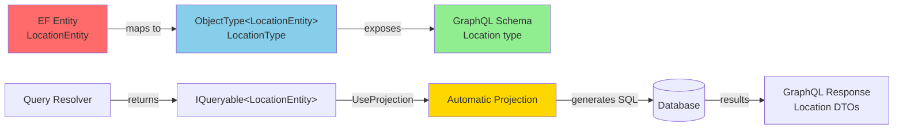

# Hot Chocolate Implementation Guide: EF/GraphQL Separation

This document describes how StuffTracker implements clean separation between Entity Framework (EF) entities and GraphQL schema using Hot Chocolate's `ObjectType<T>` pattern with automatic projections and keyset pagination.

## Table of Contents

1. [Implementation Approach](#implementation-approach)
2. [ObjectType Pattern](#objecttype-pattern)
3. [Keyset Pagination](#keyset-pagination)
4. [Custom Sort Types](#custom-sort-types)
5. [Resolver Patterns](#resolver-patterns)
6. [Best Practices](#best-practices)
7. [References](#references)

---

## Implementation Approach

### Architecture Overview



### Key Principles

1. **Clean Separation**: EF entities (`LocationEntity`, `RoomEntity`, `ItemEntity`) never appear in GraphQL schema
2. **Automatic Projection**: Hot Chocolate's `[UseProjection]` handles Entity → DTO mapping automatically
3. **Efficient Queries**: Filtering, sorting, and pagination translate directly to optimized SQL
4. **Type Safety**: Compiler enforces correct relationships between entities and GraphQL types

### Configuration

```csharp
// Program.cs
builder.Services
    .AddGraphQLServer()
    .AddQueryType<Query>()
    .AddMutationType<Mutation>()
    .AddType<LocationType>()            // Register ObjectType<LocationEntity>
    .AddType<RoomType>()                // Register ObjectType<RoomEntity>
    .AddType<ItemType>()                // Register ObjectType<ItemEntity>
    .AddProjections()                   // Enable automatic projections
    .AddFiltering()                     // Enable filtering
    .AddSorting()                       // Enable sorting
    .AddType<LocationSortType>()        // Custom sort types for determinism
    .AddType<ItemSortType>()
    .AddDbContextCursorPagingProvider() // Enable keyset pagination
    .ModifyPagingOptions(opt => {
        opt.DefaultPageSize = 50;
        opt.MaxPageSize = 1000;
        opt.IncludeTotalCount = true;
    });
```

---

## ObjectType Pattern

### Defining GraphQL Types

GraphQL types are defined as `ObjectType<TEntity>` classes that map EF entities to the GraphQL schema:

```csharp
// StuffTracker.Api/GraphQL/Types/LocationType.cs
public class LocationType : ObjectType<LocationEntity>
{
    protected override void Configure(IObjectTypeDescriptor<LocationEntity> descriptor)
    {
        descriptor.Name("Location");  // GraphQL type name
        
        // Let Hot Chocolate infer fields from entity properties
        descriptor.Field(l => l.Id);
        descriptor.Field(l => l.Name);
        descriptor.Field(l => l.CreatedAt);
        
        // Exclude navigation properties from automatic exposure
        descriptor.Ignore(l => l.Rooms);
    }
}
```

### Benefits

| Benefit | Description |
|---------|-------------|
| **Separation** | EF entity structure hidden from GraphQL clients |
| **Automatic Mapping** | Hot Chocolate handles projection without manual `Select()` |
| **Schema Control** | Explicitly control which fields are exposed |
| **Performance** | `[UseProjection]` analyzes GraphQL queries to fetch only requested fields |

### Example GraphQL Type Definitions

```csharp
// LocationType.cs
public class LocationType : ObjectType<LocationEntity>
{
    protected override void Configure(IObjectTypeDescriptor<LocationEntity> descriptor)
    {
        descriptor.Name("Location");
        descriptor.Field(l => l.Id);
        descriptor.Field(l => l.Name);
        descriptor.Field(l => l.CreatedAt);
        descriptor.Ignore(l => l.Rooms);  // Don't auto-expose navigation
    }
}

// RoomType.cs
public class RoomType : ObjectType<RoomEntity>
{
    protected override void Configure(IObjectTypeDescriptor<RoomEntity> descriptor)
    {
        descriptor.Name("Room");
        descriptor.Field(r => r.Id);
        descriptor.Field(r => r.Name);
        descriptor.Field(r => r.LocationId);
        descriptor.Field(r => r.CreatedAt);
        descriptor.Ignore(r => r.Location);  // Control nested data exposure
        descriptor.Ignore(r => r.Items);
    }
}

// ItemType.cs
public class ItemType : ObjectType<ItemEntity>
{
    protected override void Configure(IObjectTypeDescriptor<ItemEntity> descriptor)
    {
        descriptor.Name("Item");
        descriptor.Field(i => i.Id);
        descriptor.Field(i => i.Name);
        descriptor.Field(i => i.Quantity);
        descriptor.Field(i => i.RoomId);
        descriptor.Field(i => i.CreatedAt);
        descriptor.Ignore(i => i.Room);  // Control nested data exposure
    }
}
```

---

## Keyset Pagination

### What is Keyset Pagination?

Keyset pagination uses composite `WHERE` clauses based on field values instead of `OFFSET` for better performance:

```sql
-- Traditional Offset Pagination (SLOW for large offsets)
SELECT * FROM Locations ORDER BY Name, Id LIMIT 10 OFFSET 1000;  -- Scans 1000 rows

-- Keyset Pagination (FAST, consistent performance)
SELECT * FROM Locations 
WHERE (Name, Id) > ('Home', 2)  -- Cursor values from previous page
ORDER BY Name, Id 
LIMIT 10;  -- Uses index to seek directly
```

### Configuration

Enable keyset pagination globally:

```csharp
builder.Services
    .AddGraphQLServer()
    .AddDbContextCursorPagingProvider()  // ← Enables keyset pagination
    .ModifyPagingOptions(opt => {
        opt.DefaultPageSize = 50;
        opt.MaxPageSize = 1000;
        opt.IncludeTotalCount = true;
        opt.RequirePagingBoundaries = false;
    });
```

### Required Database Indexes

Composite indexes are critical for efficient keyset queries:

```sql
-- Location indexes for (Name, Id) and (CreatedAt, Id) sorts
CREATE INDEX IX_Locations_Name_Id ON Locations (Name, Id);
CREATE INDEX IX_Locations_CreatedAt_Id ON Locations (CreatedAt, Id);

-- Item indexes for common sort patterns
CREATE INDEX IX_Items_Name_Id ON Items (Name, Id);
CREATE INDEX IX_Items_Quantity_Id ON Items (Quantity, Id);
CREATE INDEX IX_Items_CreatedAt_Id ON Items (Quantity, Id);
```

### Performance Comparison

| Aspect | Offset Pagination | Keyset Pagination |
|--------|------------------|-------------------|
| **Performance** | O(n) - degrades with page number | O(log n) - consistent |
| **Page 1** | Fast | Fast |
| **Page 100** | Slow (scans 1000 rows) | Fast (index seek) |
| **Page 1000** | Very slow (scans 10000 rows) | Fast (index seek) |
| **Cursor Stability** | Invalid if data changes | Remains valid |
| **SQL Pattern** | `LIMIT 10 OFFSET 1000` | `WHERE (field, id) > (val1, val2)` |

### GraphQL Query Example

```graphql
# First page
query {
  locations(first: 5, order: { name: ASC }) {
    nodes { id name }
    pageInfo {
      hasNextPage
      endCursor  # Use this for next page
    }
  }
}

# Next page using cursor
query {
  locations(first: 5, after: "cursor_value", order: { name: ASC }) {
    nodes { id name }
    pageInfo {
      hasNextPage
      endCursor
    }
  }
}
```

---

## Custom Sort Types

### Purpose

Custom sort types ensure deterministic pagination by explicitly exposing `Id` as a sortable field, allowing it to be used as a tiebreaker.

### Implementation

```csharp
// StuffTracker.Api/GraphQL/Sorting/LocationSortType.cs
public class LocationSortType : SortInputType<LocationEntity>
{
    protected override void Configure(ISortInputTypeDescriptor<LocationEntity> descriptor)
    {
        descriptor.Name("LocationSortInput");
        descriptor.BindFieldsImplicitly();  // Bind Name, CreatedAt, etc.
        descriptor.Field(l => l.Id).Name("id");  // Explicitly expose Id for tiebreaking
    }
}

// StuffTracker.Api/GraphQL/Sorting/ItemSortType.cs
public class ItemSortType : SortInputType<ItemEntity>
{
    protected override void Configure(ISortInputTypeDescriptor<ItemEntity> descriptor)
    {
        descriptor.Name("ItemSortInput");
        descriptor.BindFieldsImplicitly();  // Bind Name, Quantity, etc.
        descriptor.Field(i => i.Id).Name("id");  // Explicitly expose Id for tiebreaking
    }
}
```

### Why Custom Sort Types?

**Problem**: Without `Id` as a sort field, queries sorting by non-unique fields (like `name`) can produce non-deterministic results, breaking cursor pagination.

**Solution**: Custom sort types explicitly expose `Id`, allowing clients to specify stable sort orders:

```graphql
# Without Id tiebreaker (non-deterministic if names duplicate)
query { locations(first: 10, order: { name: ASC }) { ... } }

# With Id tiebreaker (deterministic)
query { locations(first: 10, order: { name: ASC, id: ASC }) { ... } }
```

### SQL Generated

```sql
-- Without Id: non-deterministic
ORDER BY Name

-- With Id: deterministic
ORDER BY Name, Id
```

---

## Resolver Patterns

### Query Resolver Pattern

Queries return `IQueryable<Entity>` and rely on middleware for filtering, sorting, and pagination:

```csharp
[UsePaging]                               // Enables cursor pagination
[UseProjection]                           // Enables automatic Entity → DTO projection
[UseFiltering]                            // Enables client-side filtering
[UseSorting(typeof(LocationSortType))]    // Enables sorting with custom sort type
public IQueryable<LocationEntity> GetLocations(StuffTrackerDbContext context)
    => context.Locations;  // Return IQueryable - let middleware handle the rest
```

**Middleware Order**: `UsePaging` → `UseProjection` → `UseFiltering` → `UseSorting`

### Single Item Query Pattern

```csharp
[UseProjection]
public LocationEntity? GetLocation(int id, StuffTrackerDbContext context)
    => context.Locations.FirstOrDefault(l => l.Id == id);
```

### Mutation Resolver Pattern

Mutations return entities directly, and `[UseProjection]` handles DTO mapping:

```csharp
[UseProjection]
public async Task<LocationEntity> AddLocation(
    string name,
    StuffTrackerDbContext context,
    CancellationToken cancellationToken)
{
    var location = new LocationEntity 
    { 
        Name = name, 
        CreatedAt = DateTime.UtcNow 
    };
    
    context.Locations.Add(location);
    await context.SaveChangesAsync(cancellationToken);
    
    return location;  // Hot Chocolate projects to Location DTO automatically
}
```

### Delete Mutation Pattern

```csharp
public async Task<bool> DeleteItem(
    int itemId,
    StuffTrackerDbContext context,
    CancellationToken cancellationToken)
{
    var item = await context.Items.FindAsync(itemId);
    if (item == null)
        throw new GraphQLException("Item not found.");
    
    context.Items.Remove(item);
    await context.SaveChangesAsync(cancellationToken);
    
    return true;
}
```

---

## Best Practices

### 1. Always Return Entities from Resolvers

✅ **DO**: Return `IQueryable<Entity>` or `Entity` directly

```csharp
public IQueryable<LocationEntity> GetLocations(StuffTrackerDbContext context)
    => context.Locations;
```

❌ **DON'T**: Manually project to DTOs

```csharp
// Not needed - Hot Chocolate handles this
public IQueryable<Location> GetLocations(StuffTrackerDbContext context)
    => context.Locations.Select(l => new Location { ... });
```

### 2. Use Custom Sort Types for Paginated Queries

✅ **DO**: Define custom sort types with explicit `Id` field

```csharp
[UsePaging]
[UseSorting(typeof(LocationSortType))]
public IQueryable<LocationEntity> GetLocations(...)
```

❌ **DON'T**: Rely on default sorting without `Id` tiebreaker

```csharp
[UsePaging]
[UseSorting]  // Missing custom sort type
public IQueryable<LocationEntity> GetLocations(...)
```

### 3. Register ObjectType Classes, Not Entities

✅ **DO**: Register `ObjectType<Entity>` classes

```csharp
.AddType<LocationType>()  // LocationType : ObjectType<LocationEntity>
```

❌ **DON'T**: Register entities directly

```csharp
.AddType<LocationEntity>()  // Exposes EF entity to GraphQL
```

### 4. Let Middleware Handle Ordering

✅ **DO**: Let `[UseSorting]` handle ordering

```csharp
public IQueryable<LocationEntity> GetLocations(StuffTrackerDbContext context)
    => context.Locations;  // No OrderBy() needed
```

❌ **DON'T**: Hardcode `OrderBy()` in resolvers

```csharp
public IQueryable<LocationEntity> GetLocations(StuffTrackerDbContext context)
    => context.Locations.OrderBy(l => l.Id);  // Conflicts with client sorting
```

### 5. Create Composite Indexes for Sort Fields

✅ **DO**: Create indexes for common sort patterns

```sql
CREATE INDEX IX_Locations_Name_Id ON Locations (Name, Id);
```

❌ **DON'T**: Rely on single-column indexes

```sql
CREATE INDEX IX_Locations_Name ON Locations (Name);  -- Insufficient for keyset
```

---

## References

### Hot Chocolate Documentation
- [ObjectType Documentation](https://chillicream.com/docs/hotchocolate/v15/defining-a-schema/object-types)
- [Projections](https://chillicream.com/docs/hotchocolate/v15/fetching-data/projections)
- [Pagination](https://chillicream.com/docs/hotchocolate/v15/fetching-data/pagination)
- [Filtering](https://chillicream.com/docs/hotchocolate/v15/fetching-data/filtering)
- [Sorting](https://chillicream.com/docs/hotchocolate/v15/fetching-data/sorting)

### GraphQL Specifications
- [GraphQL Cursor Connections Specification](https://relay.dev/graphql/connections.htm)

### Related Documentation
- [Custom Sort Types](Custom-Sort-Types.md) - Detailed guide to custom sort type implementation
- [../KEYSET_PAGINATION_IMPLEMENTATION.md](../KEYSET_PAGINATION_IMPLEMENTATION.md) - Keyset pagination setup and testing
- [../README_Nitro.md](../README_Nitro.md) - GraphQL IDE usage guide with query examples

### Implementation Files
- Query Resolvers: `StuffTracker.Api/GraphQL/Query.cs`
- Mutation Resolvers: `StuffTracker.Api/GraphQL/Mutation.cs`
- GraphQL Configuration: `StuffTracker.Api/Program.cs`
- GraphQL Types: `StuffTracker.Api/GraphQL/Types/*.cs`
- Sort Types: `StuffTracker.Api/GraphQL/Sorting/*.cs`

---

**Last Updated**: November 3, 2025  
**Hot Chocolate Version**: 15.1.11  
**.NET Version**: 9.0
